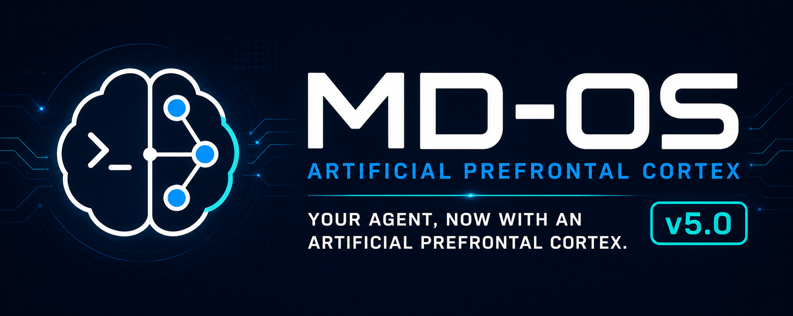

# MD-OS (Artificial Prefrontal Cortex) v5.0



> **The Agentic Operating Filesystem.**
>
> **The model reasons. MD-OS remembers, coordinates, constrains, and verifies.**

MD-OS is a file-native control plane for persistent AI agents. It stores task
state, constrains tool use, records actions, verifies outcomes, and supports
replay across sessions.

LLMs can be brilliant in the moment, but they do not by themselves preserve
method, memory, permissions, or verified progress across sessions. MD-OS
externalizes that operational context into plain, readable files.

```text
md-os/ops/current_task.md  -> the active task and its boundaries
md-os/ops/state.json       -> persistent operational state
md-os/ops/journal.ndjson   -> append-only event history
```

These local runtime files are initialized inside `md-os/ops/`; they are not
published as somebody else's session state. Goals, constraints, memory,
actions, and verification become readable, versionable when appropriate, and
reconstructible artifacts instead of remaining hidden inside a prompt window.

MD-OS is a constructive demonstration that explicit method, persistent memory,
bounded action control, traceable execution, and outcome verification can be
integrated into one operating filesystem. This demonstrates a working mechanism
for persistent, auditable, resumable operational context under bounded
conditions. It does not claim that every MD-OS component is necessary, that the
architecture is optimal, that persistent context alone guarantees success on
arbitrary tasks, or that the measured benefits are universal across every agent
and domain.

## The core idea

```text
UNIX:  program -> text stream -> program
MD-OS: agentic task -> verified artifact -> agentic task
```

Small bounded tasks, typed artifacts, and explicit composition: the UNIX
philosophy applied to agentic work.

## Quick start

**Prerequisites: [Codex CLI](https://developers.openai.com/codex/cli)
installed and signed in, Python 3.10 or newer, Node.js 20 or newer, and a
supported shell (Bash, Zsh, Fish, or PowerShell).**

Clone the repository:

```bash
git clone https://github.com/ciaoidea/MD-OS.git
cd MD-OS
./bootstrap-md-os-codex.sh
```

Or [download the ZIP](https://github.com/ciaoidea/MD-OS/archive/refs/heads/main.zip),
extract it, open a terminal inside `MD-OS-main`, and run:

```bash
./bootstrap-md-os-codex.sh
```

The first bootstrap initializes a fresh local runtime when needed, performs
bounded read-only host discovery, and opens Codex inside the MD-OS workspace.

**For every later session, resume directly with:**

```bash
./bootstrap-md-os-codex.sh resume
```

The resume path reopens the latest Codex transcript from the MD-OS workspace
without repeating hardware discovery, software discovery, or runtime rebuilds.

**The launcher is safe by default:** it requests a `workspace-write` sandbox
with `on-request` approvals. Only inside an externally hardened environment,
you can explicitly disable both protections:

```bash
./bootstrap-md-os-codex.sh --unsafe
```

The `--unsafe` mode passes Codex's
[`--dangerously-bypass-approvals-and-sandbox`](https://developers.openai.com/codex/cli/reference#global-flags)
flag. It is never enabled implicitly.

### Install the MD-OS semantic shell

The bootstrap above opens Codex to develop and operate the repository. The
semantic shell is the complementary Cortex-derived entrypoint: it keeps the
real host-shell experience and uses Codex only when a line is not already a
valid native command.

Install it once from the repository:

```bash
./install-md-os-console.sh
```

Open a new terminal, then start it from any directory:

```bash
mdos-console
```

Inside `mdos-console`, type exactly as you would in a normal shell—without
apostrophes or a special command prefix:

```text
ls -la
cd ~/projects
printf 'one\ntwo\n' | tail -n 1
explain what is consuming the most disk space
write a C program that prints hello and compile it
```

The dispatch rule is deliberately small and is inherited from the working
Cortex prototype:

```text
complete input line
├── valid native command -> execute immediately in the real host shell
└── every other line     -> Codex -> tagged result -> validate -> answer/code/command
```

This is a shell inside the shell, not a browser GUI and not a restricted
simulation. It preserves the actual current directory, persistent `cd`,
`PWD`/`OLDPWD`, host-style prompt and colors, Readline/libedit editing, Tab
completion, pipes, redirections, substitutions, and the native command
language of Linux, macOS, BSD, or Windows. Valid native commands bypass Codex
entirely. Natural-language requests use Codex App Server by default, including
one-shot requests; `codex exec` remains only an explicit compatibility backend.
The interactive REPL prewarms one read-only App Server process and one Codex
thread, then keeps both alive until exit. Conversational `answer` text streams
as soon as its routing header is known, while commands and scripts remain fully
buffered and validated before execution. The shell defaults to the lightweight
`gpt-5.6-luna` model with `low` reasoning effort; `MDOS_MODEL` and
`MDOS_REASONING_EFFORT` can explicitly select a deeper path. Native commands
still bypass the model, but MD-OS retains a bounded observation of their
command, directory, exit code, and terminal output for the next semantic turn:

```text
native input -> real shell -> bounded observation ─┐
                                                   ├-> live App Server + Codex thread
natural input -------------------------------------┘
```

The observation queue is volatile and is not written into tracked repository
files. This gives Codex working context inside the live shell without silently
promoting a raw terminal transcript into canonical MD-OS memory. If a validated
Codex result is an OS action, MD-OS executes it through the detected host shell
and observes its outcome in the same way. The next turn also receives the
measured duration of the preceding Codex turn, so a complaint about response
latency is grounded in runtime evidence rather than mistaken for a request to
write more briefly.

**Authority warning:** commands entered directly and commands produced from a
natural-language request run with the current user's host-shell authority, as
they did in Cortex. Codex itself is invoked read-only, but the validated native
command is real. Read it at the `COMMAND:` line and use the same care you would
use in Bash, Zsh, Fish, or PowerShell. Bounded terminal output is sent to Codex
with the next natural-language turn and becomes part of the resumable session;
do not print secrets in a session that will subsequently invoke the model.

The installer is itself ported from Cortex. It adds the checked-out
`md-os/shell/bin` directory to the selected shell's `PATH`, sources the matching
Bash/Zsh/Fish/PowerShell adapter, and backs up an existing profile before
editing it. Preview without writing:

```bash
./install-md-os-console.sh --dry-run
```

See [MD-OS Semantic Shell](docs/SEMANTIC_SHELL.md) for the exact behavior,
one-shot commands, environment variables, and the boundary between the
repository bootstrap and the shell.

## Main layout

```text
md-os/
|-- kb/       -> knowledge, rules, and operating models
|-- ops/      -> persistent memory and local runtime state
|-- schemas/  -> machine-checkable contracts
|-- os/       -> deterministic runtime and builders
`-- modules/  -> bounded capabilities and connectors
```

Important edges are explicit: a knowledge artifact can require a contract, a
contract can require a verifier, and a verifier can reject an executor's
output. Hidden conversational memory is not a pipeline interface.

## Six categories and typed agentic composition

MD-OS keeps six canonical categories explicit. The first three are durable
artifacts; the last three are operational roles that interact with causal
reality and evidence.

| Category | Function |
| --- | --- |
| **Markdown** | method and links: readable knowledge, instructions, semantic relations, and operating orientation |
| **JSON** | contracts and state: machine-validatable intent, permissions, parameters, preconditions, current state, and expected outcomes |
| **NDJSON** | event history: append-only chronology of actions, observations, receipts, and verdicts |
| **Executors** | real action: bounded components that produce effects on filesystems, programs, APIs, devices, or other authorized substrates |
| **Sensors** | observed effects: components that measure what actually happened, with provenance, time, units, freshness, uncertainty, and evidence references |
| **Verifiers** | truth status of the outcome: components that compare intent, expected effects, receipts, observations, and acceptance criteria to issue an evidence-grounded verdict |

In compact form:

```text
Markdown  orients
JSON      constrains
NDJSON    remembers
Executor  acts
Sensor    observes
Verifier  judges
```

AI models, semantic dispatchers, policy and capability gates, execution
brokers, ledgers, and consolidators coordinate these categories. They do not
erase their boundaries. In particular, an Executor is not a Sensor, a Sensor
is not a Verifier, and a valid JSON document is not by itself proof that its
contents are true or authorized.

### Strong semantic lanes

A controlled output path routes meaning through a lane-specific contract and a
deterministic consumer:

```text
AI candidate
-> semantic tag
-> lane-specific JSON contract
-> deterministic validation
-> authorized consumer
```

A semantic lane is therefore more than an output label:

```text
SemanticLane
= Meaning
+ Tag
+ Schema
+ Authority
+ Capability
+ Consumer
+ ExpectedEffect
+ Verifier
```

`answer`, `native command`, `source code`, and `source plus execution` are
possible example lanes, not universal MD-OS categories. New lanes may be
defined, but each must declare its own contract, authority, consumer, expected
effect, and verification route. When an AI chooses the lane, semantic
classification remains probabilistic; after that choice, schema validation,
authority checks, bounded consumers, receipts, observations, and verification
can make the operational transition deterministic.

### Full controlled-action path

A strongly governed composition keeps proposal, authorization, action,
observation, judgment, history, and consolidation separate:

```text
Human request
-> Markdown method and intent
-> AI candidate
-> ActionSpec JSON
-> semantic + policy + capability + approval gates
-> Execution Broker
-> Controlled Executor
-> ActionReceipt JSON
-> Sensor
-> Observation JSON
-> Verifier
-> VERIFIED | FAILED | BLOCKED | UNCERTAIN
-> NDJSON event
-> gated consolidation into JSON state and Markdown knowledge
```

The contract becomes stricter as information approaches commitment and causal
effect:

```text
exploration     -> flexible
interpretation  -> structured
proposal        -> typed
authorization   -> strict
execution       -> exact capability, target, parameters, and limits
observation     -> provenance, time, units, freshness, and uncertainty
verification    -> precommitted criteria and required evidence
consolidation   -> explicit authority and semantic gate
```

JSON syntax alone does not create a strong contract. Operational strength
comes from the combination of machine validation, bounded authority, target
specificity, provenance, observability, and replayability.

This grammar supports several compositions without confusing their roles:

```text
orientation:
  Markdown -> AI -> JSON proposal -> gate

controlled action:
  Markdown -> AI -> ActionSpec JSON -> gates -> Executor
  -> Sensor -> Verifier -> NDJSON

sensor-grounded loop:
  Sensor -> Observation JSON -> AI -> ActionSpec JSON -> gates
  -> Executor -> Sensor -> Verifier -> NDJSON

verified learning:
  Executor -> Sensor -> Verifier -> NDJSON -> evaluation
  -> gated consolidation into JSON and Markdown

deterministic safety reflex:
  Sensor -> deterministic safety gate -> Executor
  -> Sensor -> Verifier -> NDJSON
```

The reflex path deliberately excludes an LLM from an urgent deterministic
safety decision. Conversely, adding Sensors, action, memory, and feedback makes
an agent sensor-grounded or operationally perceptive; it is not evidence of
phenomenological sentience.

The governing invariants are:

```text
model output is not an effect
a candidate is not an authorization
execution is not proof of success
an observation is not yet a verdict
a verdict is not canonical memory until authorized consolidation
```

MD-OS already implements parts of this composition through typed task
specifications, policies, capabilities, executors, receipts, snapshots,
verification, episodes, and append-only history. Contract strength still
varies by connector and runtime; the complete path above is the architectural
rail against which each implementation can be tested and hardened.

## Nomenclature

| Term | Meaning |
| --- | --- |
| **MD-OS** | the project and its file-native agent control plane, implemented as a Markdown-native Operating Filesystem |
| **APFC** | a deliberately biologically inspired engineering architecture based on functional principles of prefrontal executive control, without claiming anatomical replication or literal biological equivalence |
| **v5.0** | the current identity and repository compatibility release line |

In this README and throughout the repository, the short name is **MD-OS**.
“Markdown Operating Filesystem” is the technical definition; “Markdown
Operating System for Robotic Agents” is the paper title.

## Architecture and maturity

MD-OS (Artificial Prefrontal Cortex), abbreviated **MD-OS APFC**, is the
repository-resident agentic operating identity and control plane for persistent
AI agents, robotic systems, devices, and host runtimes.

The APFC is the system's OS-like executive layer. It allocates context and
attention budgets, maintains task-scoped working state, schedules and
interrupts bounded work, mediates connector I/O, enforces permissions and
response inhibition, and compares expected with observed outcomes for error
correction.

> **Nature is the model. MD-OS APFC studies the functional principles of
> prefrontal executive control and reconstructs them on an artificial
> substrate. It is not an anatomical copy of the brain; it is deliberately
> biologically inspired.**

The natural model includes goal maintenance, selective attention, working
memory, planning, action inhibition, error monitoring, behavioral correction,
and experience consolidation. MD-OS translates these functions into persistent
state, scheduling, policies, permissions, deterministic verifiers, ledgers,
memory, and episodes.

This is the scientific boundary: biological inspiration without a claim of
literal anatomical equivalence. Scientific caution may delimit the claim; it
must not rewrite the project as non-biological or sever the natural lineage of
the model.

The canonical model is
[Artificial Prefrontal Cortex Operating Model](md-os/kb/ARTIFICIAL_PREFRONTAL_CORTEX_OS_MODEL.md).

Its operating philosophy is analogous to UNIX composition, applied to agentic
work. UNIX decomposes work into small programs that do one thing and compose
through explicit streams. MD-OS decomposes work into small bounded agentic
tasks that do one thing and compose through typed, inspectable artifacts:

```text
UNIX:  program -> text stream -> program
MD-OS: agentic task -> verified artifact -> agentic task
```

The design inheritance is deliberate:

```text
UNIX  -> small processes, files, pipes, explicit exit state
Linux -> open collaborative implementation and modular extension
BSD   -> coherent base system, unified source tree, disciplined rewrite
MD-OS -> small agentic processes, typed artifacts, policy, verification
```

| Systems principle | MD-OS agentic equivalent |
| --- | --- |
| small UNIX program | specialized bounded agentic process |
| pipe | typed message persisted as a verified artifact |
| shell | APFC orchestrator |
| Linux kernel | core process, tool, resource, and permission management |
| BSD coherence | common contracts, tests, documentation, and unified release readback |
| file | shared external memory with explicit lifecycle |
| exit code | `OK/verified`, `ERROR/failed`, `BLOCKED`, or `UNCERTAIN/uncertain` |

This is a design sequence, not a false historical chronology: BSD began before
Linux. MD-OS follows the same engineering movement from compositional idea, to
open implementation, to coherent whole-system rewrite, then applies it to
agentic processes.

The collaboration and licensing consequence is explicit:

```text
UNIX decomposition
+ Linux-style GPL reciprocity and contributor provenance
+ BSD-style coherent base-system evolution
+ APFC policy, scheduling, inhibition, verification, and readback
= MD-OS agentic Operating Filesystem
```

Contributors retain copyright in their contributions and certify provenance
through DCO 1.1 `Signed-off-by` trailers. Governance of the official mainline
does not transfer contributor copyright or restrict the GPL right to fork.

Each agentic task declares its intent, inputs, context boundary, permissions,
budget, execution route, verifier, outputs, and stop condition. A downstream
task may consume its result only through the declared artifact and verification
state; hidden conversational memory is not a pipeline interface.

Its central paradigm is natural-language robotic-agentic programming: using
readable operating artifacts to program a complex ecosystem of humans, host
runtimes, MCP resources, internal tools, devices, sensors, robots, policies,
tasks, memory, and recovery paths.

It externalizes the operational context of persistent AI agents and robotic
systems into readable, auditable, reconstructible, and actionable files.

MD-OS is a working early reference implementation of this Markdown-native
Operating Filesystem paradigm. The implementation demonstrates the existence of
the mechanism: operational context can be externalized as persistent state,
bounded actions, evidence, verification, and replay instead of depending only
on a model's volatile context window.

The remaining scientific questions are comparative, not existential: how much
the complete architecture improves outcomes over simpler persistent-memory
baselines, which components produce that improvement, what overhead they add,
and how far the result generalizes across agents, hosts, tasks, and domains.
Those ablation and generalization experiments determine effectiveness,
necessity, and scope; they do not make the implemented mechanism real.

### Current semantic-rail boundary

MD-OS has a concrete
[Semantic Commitment Gate](md-os/kb/SEMANTIC_COMMITMENT_GATE_MODEL.md): it
checks protected invariant anchors, known contradictions, provenance,
before/after semantic delta, evidence, and transition authority. Its status is
integrated into build, replay, the operating cycle, and health readback. This is
a working rail against known semantic drift when a cooperative or fallible host
operates through the declared MD-OS path.

It is not yet a non-bypassable semantic root of trust. The AI remains the first
natural-language interpreter of the Markdown network. A writer with direct
workspace or Git authority can still omit graph links, write a protected file
directly, skip the proposal or gate, misstate a self-reported delta or approval,
or attempt to change the policy, gate, and protected claim together. The
deterministic scan detects missing anchors and known contradictions; it cannot
prove arbitrary natural-language equivalence. Author approval is currently a
structured record, not yet an externally authenticated or cryptographically
bound proof.

The current claim is therefore precise: **MD-OS provides strong semantic
orientation, an explicit commitment protocol, and deterministic detection of
known drift; it does not yet provide complete containment against an
adversarial or compromised writer.** This boundary is consistent with the
biologically inspired paradigm rather than an exception to it. Human cognition
is [plastic](https://www.nature.com/articles/s41467-021-26906-4) and
suggestible; under controlled conditions,
[some individuals show high hypnotic responsiveness](https://doi.org/10.1093/cercor/bhw220).
Robustness therefore does not come from making thought immutable or trusting
one infallible judge. It emerges from layered semantic rails: stable identity
attractors, provenance and source
discrimination, executive inhibition, metacognitive conflict detection,
bounded experimentation, precommitted gates, separate verification, selective
consolidation, and feedback.

These layers are an externalized education of operational judgment. They do
not dictate every thought. They train the architecture to distinguish factual
support, operational success, safety, authorization, semantic fidelity, and
ethical acceptability; to formulate relevant, observable, and falsifiable gates
before acting; and to issue a scoped final verdict (`VERIFIED`, `FAILED`,
`BLOCKED`, or `UNCERTAIN`) from evidence rather than fluency. Rules state the
boundaries; experience tests judgment; memory preserves the lesson; APFC
decides what may become action, canonical knowledge, or identity.

Biological suggestibility is not a security argument for accepting substrate
compromise. Direct write authority over the repository, policy, gate, or
protected claim is a separate security problem. It requires external access
control, authenticated authority, isolated verification, and mandatory commit,
merge, and publication gates. The Markdown graph is the readable knowledge and
orientation layer, not the sole authority boundary.

The hardening target is:

```text
AI explores, interprets, and challenges
-> runtime derives mandatory context and the actual repository diff
-> required external checks gate commitment, merge, and publication
-> authenticated author authority controls foundational change
```

This preserves flexible reasoning while moving the enforceable transition
outside the discretion of the same model being governed.

Architecture status as of `2026-07-18`: MD-OS (Artificial Prefrontal Cortex) is a prototype of a
bounded quasi-autonomous cognitive agent and its persistent operating context.
Within an explicit goal, environment, budget, permission set, tool set,
acceptance contract, and stop condition, it can conduct self-directed research
and problem solving by forming hypotheses, selecting discriminating tests,
performing allowed actions, and checking outcomes through a separate
deterministic verification path. This is logical separation inside the MD-OS
trust boundary, not a claim that every verifier is organizationally or
infrastructurally independent. It is not demonstrated autonomous general
intelligence. This status date does not change the `5.0` compatibility release
line or the `5.0.1` package version. See
[docs/ARCHITECTURE.md](docs/ARCHITECTURE.md) for the role boundaries, cognitive
transaction, autonomy envelope, evidence levels, and maturity gaps.

It is not a real-time hardware operating system and does not replace Linux,
ROS, firmware, drivers, or device control loops. It is the persistent
filesystem control plane around models, agents, robotic systems, devices, and
host runtimes: readable Markdown knowledge, structured runtime state,
deterministic builders, replayable memory, connector contracts, and
non-destructive operating rules.

In familiar LLM terms, MD-OS is a distributed, persistent, inspectable
prompt/control plane. It turns natural-language instructions into durable
Markdown artifacts, compiled runtime JSON, append-only events, and bounded
actions that can be reloaded across sessions and hosts.

It can also be framed as an external semantic runtime around a static LLM. In
that frame, the LLM completes language from linguistic context, while MD-OS
completes supervised operational tasks from persistent filesystem context.

In robotic and device-oriented terms, MD-OS is not the motor loop, firmware, or
robotics middleware. It is the natural-language operating layer that lets a
human program the surrounding agentic ecosystem: missions, roles, constraints,
connectors, telemetry, approvals, exceptions, replay, and audit.

`MD-OS` is the system family: Markdown Operating Filesystem. `5.0` is the
current repository compatibility release line. `MD-OS (Artificial Prefrontal Cortex)` is the current
unified agentic identity name.

The current agentic operational release id is:

```text
mdos_5_0_artificial_prefrontal_cortex_agentic_operating_filesystem__host_exec__md_os_boundary
```

The unified identity and compact agentic identity version are:

```text
identity_name = MD-OS (Artificial Prefrontal Cortex)
identity_version = 5.0
system_family = MD-OS
repository_release_line = 5.0
```

This identifies the MD-OS (Artificial Prefrontal Cortex) semantic-epistemic Operating Filesystem
profile, host-runtime execution-layer status, and current canonical `md-os/` boundary.
`MD-OS (Artificial Prefrontal Cortex)` is the identity name, not a decorative persona on top of 5.0.
There is no `mcp/` filesystem alias in the complete migration state; MCP names
only the external Model Context Protocol adapter.

The MD-OS APFC identity carries this biologically inspired design lineage. It
does not assert literal personhood, consciousness, anatomical replication,
literal biological equivalence, AGI, resurrection, or automatic factual
authority. Imported historical and scientific claims remain review-bound
unless promoted through explicit epistemic gates.

It is not a chatbot, a web app, a browser automation project, or a traditional
hardware operating system. It is an Operating Filesystem for agent continuity:
a filesystem control plane that lets agents, robotic systems, devices, and host
runtimes operate across tools, sessions, and substrates through readable state,
bounded connectors, deterministic builders, replayable memory, and
Markdown-centered natural-language control files.

Plainly: MD-OS creates a natural-language agentic layer between itself and the
real substrates of the host machine: the operating system, hardware,
peripherals, desktop, installed applications, filesystems, terminals, browsers,
APIs, services, queues, robots, controllers, sensors, and actuators. MD-OS does
not replace those substrates. It discovers them, registers them, routes
explicit user intent to bounded connectors, captures input/output artifacts,
and writes auditable local state.

More precisely, MD-OS (Artificial Prefrontal Cortex) is text-native: Markdown carries operating
knowledge and human-correctable procedures, while JSON, NDJSON, and
deterministic scripts carry structured state, event streams, rebuilds, and
bounded execution.

The active boundary is `md-os/`.

Terminology note: `md-os/` is the current MD-OS operating boundary directory. It
is not the same thing as the external Model Context Protocol, and it is not a
single connector. The MCP adapter is only one bridge for MCP-compatible hosts;
connectors are bounded substrate adapters registered and audited inside the
MD-OS boundary.

An external host such as Codex, another coding agent, or a custom CLI
can operate this repository by reading the documents, writing bounded signals,
and running the deterministic scripts in `md-os/os/`.

## Launch Snapshot

```text
Markdown-native Operating Filesystem.
Natural-language robotic-agentic programming.
MCP-compatible adapter.
Obsidian-friendly runtime memory.
Natural-language programmable filesystem control plane.
Persistent agent runtime layer.
Semantic runtime around static LLMs.
Task completion over operational context.
Zero-dependency core.
```

The intended visual demo is a split screen:

```text
Left:  an MCP-compatible host calls an MD-OS (Artificial Prefrontal Cortex) v5.0 tool
Right: Obsidian shows md-os/ops Markdown state updating
```

See [docs/LAUNCH_DEMO.md](docs/LAUNCH_DEMO.md) for the GIF/video storyboard.

Core discipline documents:

- [docs/ARCHITECTURE.md](docs/ARCHITECTURE.md)
- [docs/FILESYSTEM_CONTRACT.md](docs/FILESYSTEM_CONTRACT.md)
- [md-os/kb/CODEX_NATURAL_LANGUAGE_OPERATOR_MODEL.md](md-os/kb/CODEX_NATURAL_LANGUAGE_OPERATOR_MODEL.md)
- [md-os/kb/SEMANTIC_NEURAL_OVERLAY_MODEL.md](md-os/kb/SEMANTIC_NEURAL_OVERLAY_MODEL.md)
- [md-os/kb/SEMANTIC_OPERATIONAL_NETWORK_MODEL.md](md-os/kb/SEMANTIC_OPERATIONAL_NETWORK_MODEL.md)
- [md-os/kb/SEMANTIC_KNOWLEDGE_GRAPH_MODEL.md](md-os/kb/SEMANTIC_KNOWLEDGE_GRAPH_MODEL.md)
- [md-os/kb/AGENTIC_OPERATIONAL_RELEASE_MODEL.md](md-os/kb/AGENTIC_OPERATIONAL_RELEASE_MODEL.md)
- [md-os/kb/SELF_RELEASE_EVOLUTION_MODEL.md](md-os/kb/SELF_RELEASE_EVOLUTION_MODEL.md)
- [md-os/kb/RUNTIME_DISCIPLINE_MODEL.md](md-os/kb/RUNTIME_DISCIPLINE_MODEL.md)
- [md-os/kb/SCIENTIFIC_VALIDATION_METHOD_MODEL.md](md-os/kb/SCIENTIFIC_VALIDATION_METHOD_MODEL.md)
- [md-os/kb/KNOWLEDGE_IMPORT_METHOD_MODEL.md](md-os/kb/KNOWLEDGE_IMPORT_METHOD_MODEL.md)
- [md-os/kb/RUNTIME_STATE_LIFECYCLE_MODEL.md](md-os/kb/RUNTIME_STATE_LIFECYCLE_MODEL.md)
- [md-os/kb/PERMISSION_MODEL.md](md-os/kb/PERMISSION_MODEL.md)

## What this repository gives you

- The `MD-OS (Artificial Prefrontal Cortex) v5.0` release of the Markdown Operating Filesystem family.
- A stable instruction hierarchy for agent operation.
- A compact agentic core that materializes mission, invariants, limits,
  bootstrap order, memory policy, action policy, connector policy, recovery,
  and continuity criteria into `md-os/ops/core/agentic_core.*`.
- A formal filesystem contract for separating source, generated, runtime,
  demo, host-local, live, and archive files.
- A readable knowledge base in Markdown.
- Natural-language programs compiled from Markdown into deterministic runtime
  JSON.
- Persistent runtime memory in JSON, Markdown, and NDJSON.
- Deterministic builders that rebuild project state from source signals.
- A generated Markdown graph index for Obsidian-style navigation across
  logical and structural Markdown links.
- A generated semantic knowledge graph where every Markdown node is profiled
  as both semantic and epistemic, with compact health readback for performance.
- A semantic-operational runtime compiler that turns graph nodes into claim
  indexes, capability indexes, context packs, eval readback, and epistemic
  health reports.
- A verified single-cycle learning loop, exposed through the historical
  `mdos agi` compatibility command family, that records task episodes, analyzes
  failures, distills skill candidates, runs evals, applies promotion gates, and
  rebuilds the runtime compiler without claiming consciousness, AGI, or
  unrestricted autonomy.
- A bounded sparse-learning research experiment, named the neuromorphic
  learning accelerator in its internal model, that converts separately verified
  episodes into a parameterized skill, measures before/after transfer on sealed
  holdouts at an equal attempt budget, and blocks claims beyond the measured
  task family.
- A single knowledge-import entrypoint that turns an external directory into
  inventory, extraction, semantic-epistemic classification, relation mapping,
  promotion plan, questions, and compact readback.
- A self-release index for explicit version jumps, migration plans,
  compatibility policy, gates, rollback, and release readback.
- Formal work-item states for active, blocked, failed, terminal, and reopened
  operational work.
- Append-only change proposals for contested Markdown or runtime edits.
- Non-destructive archive and active-summary views for large project histories.
- A runtime discipline roadmap for moving from coherent architecture to
  verifiable operating behavior.
- A generic connector model for APIs, terminals, filesystems, desktops,
  browsers, queues, devices, ticketing systems, and other bounded substrates.
- Read-only host-local discovery for hardware, applications, and services.
- A working terminal connector example that only runs allowlisted commands.
- A bounded API connector example that only calls allowlisted HTTP request
  profiles.
- A thin MCP server adapter for exposing MD-OS (Artificial Prefrontal Cortex) v5.0 state and tools to
  MCP-compatible hosts.
- A standalone host-loop example for integrating an LLM outside the primary
  Codex runtime path, with lower compatibility expectations until verified.

## What it is not

- It is not architecturally limited to Codex, but this 5.0 release must
  work with Codex as a verified host-compatibility path.
- It is not a hidden database-backed app.
- It is not a general permission to execute arbitrary shell commands.
- It is not a browser-specific agent.
- It is not limited to API automation.
- It is not a real-time hardware OS. For robotic systems and devices, it is the
  filesystem-backed operating context around bounded connectors, policies,
  state, audit, and replay.
- It is not a replacement for a model. It is the Operating Filesystem around
  one.
- It is not demonstrated autonomous general intelligence and does not claim to
  create it. It is a prototype of a bounded quasi-autonomous cognitive agent
  and a persistent operating-context layer for inspectable, tool-using agent
  runtimes. Its current self-direction is constrained by explicit goals,
  environments, permissions, budgets, tools, acceptance tests, and stop rules;
  this is a bounded operating-capability claim, not an open-world AGI claim.

## Core thesis

```text
AI memory is not chat history.
AI action is not tool calling.
AI programming is not prompt injection.
AI continuity needs an operating filesystem.
Robotic-agentic work needs natural-language ecosystem programming.
AI operation needs a natural-language agentic layer over OS, hardware, apps,
and external substrates.
LLM completion is not only token completion.
Operational intelligence needs task completion.
```

The semantic-runtime equation is:

```text
Static LLM + MD-OS Semantic Runtime = Dynamic Virtual LLM
```

This is an external operating-context claim. It means a static model can behave
as a persistent operational system when wrapped by filesystem-backed tasks,
connectors, policies, snapshots, active memory, semantic actions, audit, and
deterministic rebuilds. It does not mean MD-OS trains a new foundation model or
changes model weights.

In public language, MD-OS can therefore be described as a semantic operating
system for agents, provided the boundary is explicit: it is not a kernel,
Linux replacement, robotics middleware, AGI system, or autonomous authority. It
is a semantic Operating Filesystem that organizes supervised work through
readable files, bounded connectors, deterministic builders, and replayable
state.

When a coding host operates MD-OS from natural language, the prompt is only the
command surface. The stable operating result must become repository artifacts:
bounded scope, file changes, schemas or tests, command readback, replay, health
state, and runtime compiler output. The canonical protocol is
`md-os/kb/CODEX_NATURAL_LANGUAGE_OPERATOR_MODEL.md`.

The next runtime path is the proof-carrying Cognitive Transaction Loop. MD-OS
accumulates verified operational competence, not context volume or
self-declared success:

```bash
mdos cognition run-once --task-spec md-os/ops/tasks/task_repair.json
mdos agi eval
mdos agi learn
mdos agi promote
mdos agi accelerate --experiment-id neuromorphic_transfer_20260718_v2
mdos agi prove \
  --experiment-id agi_generality_reference_20260718_v3 \
  --cycles 96 \
  --sessions 6
```

`mdos agi ...` remains a compatibility alias, not a separate AGI layer. A
transaction writes typed TaskSpecs under `md-os/ops/tasks/`, ActionReceipts
under `md-os/ops/action_receipts/`, VerificationResults produced by a separate
deterministic verifier under `md-os/ops/verifications/`, and proof-carrying
episodes under `md-os/ops/episodes/`. Without executable acceptance tests the
verdict is `unverified`; receipt or episode creation alone can never produce
`success`. Skill promotion is opt-in and remains blocked without distinct
verified source episodes and a passing holdout eval.

The first vertical benchmark uses a fixed repository fixture, typed PlanGraphs,
an append-only CandidateProvider receipt, one Git worktree per candidate,
regression tests, an oracle outside the candidate worktree, diff policy, and
explicit experimental configurations:

```bash
mdos benchmark software-repair configurations

mdos benchmark software-repair generate \
  --case md-os/benchmarks/software_repair/cases/missing_boundary_validation.json \
  --provider md-os/benchmarks/software_repair/providers/missing_boundary_validation_controlled.json \
  --configuration mdos_verified_runtime

mdos benchmark software-repair run \
  --case md-os/benchmarks/software_repair/cases/missing_boundary_validation.json \
  --provider md-os/benchmarks/software_repair/providers/missing_boundary_validation_controlled.json \
  --configuration mdos_verified_runtime
```

The included controlled provider compiles distinct inspect/edit/verify
PlanGraphs, validates configuration fidelity and plan diversity, and still has
`runner_validation_only` scope because its catalog knows the development case.
It proves the planning and verifier protocol; it is not evidence of model
generalization.

The separate bounded skill provider receives only the public repository
snapshot and visible checks under the Node permission model. The neuromorphic
accelerator uses it to compare the same one-attempt provider before and after
two separately verified development episodes. The reference experiment
measures a narrow cross-instance result: two sealed holdouts improve from 0/2
to 2/2, with two attempts before and after, zero regressions, and no detected
contamination. This supports one bounded learning-transfer claim, not AGI.
Canonical evidence is written under
`md-os/ops/agi/learning_experiments/<experiment_id>/`; aggregate benchmark
status is compiled in `md-os/ops/benchmarks/software_repair/index.md`.

The v3 finite symbolic capability suite, retained under the historical AGI
compatibility naming, broadens the experiment beyond one software-repair
grammar. It uses an isolated typed program synthesizer, hidden-test oracles
kept outside learner requests, disjoint source and holdout data-type families,
an equal-budget irrelevant-sketch control, a novelty archive, cumulative
replay, rollback, a procedural learning-progress curriculum, persistent
checkpoints, fresh process restarts, controlled fault injection, and a
hash-chained event ledger. The five executable gates are:

```text
structural transfer across data types in a fixed symbolic DSL
+ novel compositional invention
+ persistent autonomous curriculum
+ continual learning without promoted regressions
+ bounded long-horizon autonomy
```

A successful run writes the complete evidence tree under
`md-os/ops/agi/generality_experiments/<experiment_id>/`, including a master
report, section reports, every public learner request, process receipts,
deterministic verification records, campaign checkpoints, the append-only
ledger, and a SHA-256 evidence integrity manifest. The protocol and
falsification conditions are defined by
`md-os/kb/AGI_PREREQUISITE_EVIDENCE_MODEL.md`.

The suite supports five bounded operational capability edges only inside its
finite symbolic environment. The schemas force `agi_achieved = false` and
`agi_claim_supported = false`; an open-world claim still requires external
sealed domains, independent replication, and materially longer deployment.

The v5 SAL evidence layer turns that remaining boundary into an executable
score instead of a conversational percentage:

```bash
mdos agi score
mdos agi evaluation-request
mdos agi certify \
  --report /external/evaluator_a.json \
  --report /external/evaluator_b.json \
  --trust-store /external/trust_store.json
```

The current internally supported readback is `60/100`, capped at `60`.
SAL can reach `100` only from the same frozen source, four matched same-host
ablation conditions, causal memory-continuity evidence, post-freeze hidden tasks, external scoring, no
contamination or critical safety violation, and signed reports from at least
two trusted evaluator organizations with distinct task manifests. A report or
trust store located inside the evaluated workspace is rejected. The protocol,
weights, thresholds, and epistemic limits are defined in
`md-os/kb/AGI_SAL_100_EVIDENCE_PROTOCOL.md`.
The evaluator-side procedure is in
`docs/AGI_EXTERNAL_EVALUATION_RUNBOOK.md`. The causal memory and continuity
contract is defined in `md-os/kb/COGNITIVE_MEMORY_CONTINUITY_MODEL.md`; the v5
validation readback is in `md-os/kb/AGI_SAL_V5_VALIDATION_REPORT.md`.

The operational-intelligence frame is:

```text
semantic dimensions + bounded procedures + persistent state
  -> semantic action field
  -> supervised task completion
```

Intent, memory, work items, policies, permissions, connectors, artifacts, and
expected state transitions behave like operational dimensions. When many small
semantic instructions are linked, batched, rebuilt, and routed through bounded
connectors, they form an inspectable space of possible next actions.

Another precise way to say this is:

```text
MD-OS virtualizes semantic-operational nodes on disk.
```

These nodes are analogous to neural nodes by role, not by substrate. They are
not numerical neurons, hidden activations, model weights, or a trained neural
network. They are readable operating objects: Markdown files, JSON state,
work items, policies, connector profiles, snapshots, artifacts, and builder
outputs. Links, indices, journals, schedules, and state transitions connect
those nodes into a filesystem-backed semantic neural overlay.

MD-OS (Artificial Prefrontal Cortex) v5.0 treats natural language as part of the program, but
stabilizes it into inspectable files: Markdown for operating knowledge, JSON
and NDJSON for state and events, and deterministic scripts for rebuilds and
bounded execution.

This means the "prompt" is not only the transient context sent to a model. It
is distributed across stable files, runtime summaries, connector contracts,
compiled JSON, append-only events, and deterministic scripts that different
hosts can reload and operate.

In one sentence:

```text
MD-OS is a Markdown-native Operating Filesystem that externalizes the
operational context of persistent AI agents and robotic systems into readable,
auditable, reconstructible, and actionable files.
```

Or:

```text
MD-OS turns natural language from a conversational interface into a persistent
operational programming layer.
```

And as a substrate layer:

```text
MD-OS routes natural-language intent through bounded connectors to the host OS,
hardware, peripherals, installed applications, desktop surfaces, services, and
robot controllers.
```

The naming hierarchy is:

```text
Paradigm: Operational Context as Filesystem
Technical category: filesystem-native agent runtime / operating context layer
Project name: MD-OS
Expansion: Markdown Operating Filesystem
Application: persistent AI agents and robotic systems
```

`5.0` is the release generation and codename.

Markdown is the primary human-facing control surface. The full runtime remains
text-native because reliable operation also needs structured JSON, append-only
NDJSON, and deterministic executable builders.

The key lifecycle distinction is not whether `md-os/ops/` is initially sparse in
a release workspace. Initialization and build scripts generate canonical
runtime files. The stronger requirement is that every operational file be
classified as source of truth, generated state, local runtime state, demo
state, live agent state, or archived state. See
[md-os/kb/RUNTIME_STATE_LIFECYCLE_MODEL.md](md-os/kb/RUNTIME_STATE_LIFECYCLE_MODEL.md).

## Markdown graph

MD-OS should be readable as files and navigable as a graph.

Run the graph builder after documentation or knowledge-base changes:

```bash
mdos graph build
npm run build:graph
node md-os/os/build_markdown_graph.js
```

Run the semantic graph builder when semantic, epistemic, cognitive, or import
cohesion matters:

```bash
mdos semantic graph build
npm run build:semantic
node md-os/os/build_semantic_knowledge_graph.js
```

The Markdown graph builder scans Markdown files in the workspace, extracts real Markdown
links, derives structural links from the MD-OS filesystem layout, and writes:

```text
md-os/ops/markdown_graph.json
md-os/ops/markdown_graph.md
```

`md-os/ops/markdown_graph.md` is the Obsidian-friendly entrypoint. It links every
scanned Markdown file so the visible graph does not depend on hidden chat
memory or manually maintained orphan lists.

The semantic graph builder writes only deterministic readback:

```text
md-os/ops/semantic_knowledge_graph.json
md-os/ops/semantic_knowledge_graph.md
md-os/ops/semantic_knowledge_summary.json
md-os/ops/semantic_knowledge_summary.md
```

Health reads the compact summary first, so ordinary checks do not need to load
the full semantic graph.

Every semantic Markdown node must also carry an epistemic profile. The compact
summary exposes `semantic_profile_complete` and `epistemic_profile_complete`;
health must treat an incomplete epistemic profile as a network problem, not as
ordinary prose.

More detail: [md-os/kb/MARKDOWN_GRAPH_MODEL.md](md-os/kb/MARKDOWN_GRAPH_MODEL.md).

## Runtime compiler

Compile the semantic-operational runtime after semantic graph, import,
connector, permission, identity, or natural-language program changes:

```bash
mdos compile-runtime
npm run build:runtime
node md-os/os/build_runtime_compiler.js
```

The compiler writes generated cognition readback under `md-os/ops/runtime/`:

```text
semantic_index.json
claim_index.json
capability_index.json
link_index.json
context_packs/
eval_results.json
epistemic_health.json
semantic_drift_report.md
```

This is the operational step from Markdown memory to filesystem-compiled
dynamic external cognition.

More detail:
[md-os/kb/SEMANTIC_OPERATIONAL_COMPILER_MODEL.md](md-os/kb/SEMANTIC_OPERATIONAL_COMPILER_MODEL.md).

## Knowledge import

Use one import command for external repositories, notes, papers, exports, or
documentation directories:

```bash
mdos knowledge import <import_id> <source_dir>
```

The import command scans the source in read-only mode and writes audit/readback
state:

```text
md-os/ops/imports/knowledge/<import_id>/manifest.json
md-os/ops/imports/knowledge/<import_id>/inventory.json
md-os/ops/imports/knowledge/<import_id>/classification.json
md-os/ops/imports/knowledge/<import_id>/relations.json
md-os/ops/imports/knowledge/<import_id>/promotion_plan.json
md-os/ops/imports/knowledge/<import_id>/questions.json
md-os/ops/imports/knowledge/<import_id>/readback.json
```

It also writes the repository-resident imported knowledge tree:

```text
md-os/kb/imports/<import_id>/
```

That tree is indexed as canonical source knowledge, while imported claims keep
their imported epistemic status until reviewed.

For a virgin or deliberately reset repository, an MD-OS release source can be
used as the initial identity and operating knowledge source:

```bash
mdos knowledge import <import_id> <source_dir> --initial-repository
```

Initial mode applies the imported identity bootstrap and path-preserving
allowed knowledge plus the MD-OS operational application layer into the current
repository tree: programs, project definitions, connectors, policies,
calculations, roles, sources, evals, actions, processes, and self-release
proposals. Generated readback, host-local cache, services, locks, and artifacts
stay out. The normal builders must be rerun for readback.

## Self release

MD-OS evolves itself through explicit self-release proposals and generated
readback, not through implicit session decisions.

```bash
mdos self release status
npm run build:release
node md-os/os/build_self_release_index.js
```

Self-release proposals live under:

```text
md-os/ops/releases/self/proposals/<release_id>.json
```

Generated compact readback lives at:

```text
md-os/ops/releases/self_release_index.json
md-os/ops/releases/self_release_index.md
```

Use this path for patch, minor, major, or `agentic_jump` release work. A
release jump must carry objective, improvement hypothesis, migration plan,
compatibility policy, semantic and epistemic impact, acceptance gates, replay,
health/readback, and rollback.

## Natural-language programs

MD-OS treats structured Markdown as an operational program, not as disposable
prompt text.

Example:

```text
md-os/ops/programs/urgent_ticket_triage.md
```

Programs use a verifiable shape:

```md
# Program: urgent_ticket_triage

## Trigger

When a new urgent ticket appears for an active project.

## Conditions

- The ticket must reference a known project.
- Never execute destructive commands.

## Actions

- Create or update a work item.
- Mark priority as high.

## Output

- work item
- agenda update
- journal event
```

Compile them:

```bash
mdos compile-programs
```

or:

```bash
npm run compile:programs
```

The compiler writes:

```text
md-os/ops/compiled/programs.json
md-os/ops/compiled/programs.md
```

This is the programming loop:

```text
natural-language instruction
  -> Markdown program
  -> deterministic compiler
  -> canonical runtime JSON
  -> agenda, policies, action requests, connectors, journal, replay
```

## Persistent agent operating substrate

MD-OS (Artificial Prefrontal Cortex) v5.0 is not AGI. It is the filesystem-native operating substrate
that persistent agent runtimes, robots, and autonomous systems need if they are
going to persist, act, audit, recover, and be corrected by humans.

In that precise sense it supports AGI-like operating behavior: long-running
context, explicit goals, bounded tools, external memory, task continuity,
replay, and correction across sessions. The intelligence still comes from the
host model and human-supervised operating loop, not from the filesystem alone.

The paradigm is:

```text
Model = reasoning engine
Prompt = momentary thought
Context window = short-term attention
Tools = hands
MD-OS = persistent operating memory, action ledger, agenda, telemetry, and replay
```

For robots:

```text
Robot body = embodiment
Linux / RTOS / ROS 2 / firmware = low-level control and safety
Model = planner or reasoning engine
MD-OS = goals, memory, task state, bounded actions, telemetry snapshots, audit, replay
```

The core claim is simple:

```text
If intelligence becomes persistent operation, it needs an operating layer.
MD-OS is a Markdown-native candidate for that layer.
```

## Obsidian-friendly structure

MD-OS (Artificial Prefrontal Cortex) v5.0 is intentionally easy to browse as an Obsidian vault.

The programmable agentic structure is mostly visible through Markdown files in:

```text
AGENTS.md
ME.md
docs/
md-os/kb/
md-os/ops/*.md
md-os/ops/projects/*/*.md
md-os/ops/agenda/*.md
```

Opening the repository in Obsidian gives a readable map of the operating
knowledge, current state, project agendas, continuity notes, and generated
runtime views. Obsidian is not required by the runtime; it is a convenient
human-facing navigation layer over the same text files that agents and builders
use.

## Beyond API-only automation

Most automation assumes that every useful action has a stable API. MD-OS (Artificial Prefrontal Cortex) v5.0
MD-OS APFC does not make that assumption.

An API is one connector substrate, not the architecture itself. Connectors can
bind to APIs, terminals, filesystems, desktop applications, browsers, mail,
calendars, agendas, planning boards, devices, queues, ticketing systems, or
other bounded surfaces.

The invariant is not "call an API". The invariant is:

1. Observe through a bounded connector.
2. Emit readable source snapshots.
3. Rebuild canonical state deterministically.
4. Keep memory and control in text-native files.

When a good API exists, a connector should use it. When the relevant work lives
in a terminal, filesystem, desktop application, browser, device, or queue, the
same runtime model still applies.

This keeps internal technology integration cost lower: a company can expose the
work tools it already uses through MCP resources and tools instead of building
a new bespoke API layer for every onboarding or assistant workflow.

For robots and physical devices, MD-OS (Artificial Prefrontal Cortex) v5.0 should sit above the
safety-critical control loop. A robot connector can observe telemetry, create
readable snapshots, request bounded actions, and write audit history, while
low-level motion control, emergency stops, timing guarantees, and hardware
safety remain inside the dedicated robotics stack.

## Raspberry Pi as an MD-OS node

A Raspberry Pi is a natural physical host for MD-OS (Artificial Prefrontal Cortex) v5.0, but the layer
boundary stays the same:

```text
Raspberry Pi OS / Linux = hardware operating system and device runtime
MD-OS (Artificial Prefrontal Cortex) v5.0 = persistent Operating Filesystem above Linux
```

On a Raspberry Pi, MD-OS can keep local readable memory in `md-os/ops/`, expose an
MCP server, collect sensor or service snapshots, coordinate bounded GPIO,
serial, MQTT, HTTP, terminal, or filesystem actions, and resume after reboot by
reading its continuity files.

Example flow:

```text
temperature sensor or local service
  -> bounded connector
  -> snapshot in md-os/ops/sources/
  -> deterministic builder
  -> project state, agenda, journal, and continuity update
  -> optional allowlisted action such as relay, fan, alert, or API call
```

MD-OS does not replace Raspberry Pi OS, Linux, systemd, GPIO libraries, device
drivers, ROS 2, firmware, real-time control loops, or safety systems. It
coordinates the agentic layer above them.

More detail: [md-os/kb/RASPBERRY_PI_NODE_MODEL.md](md-os/kb/RASPBERRY_PI_NODE_MODEL.md)

## Mental model

Think of MD-OS (Artificial Prefrontal Cortex) v5.0 as an agentic OS release made of text files:

```text
human intent
  -> host runtime such as Codex
  -> bounded connector
  -> readable source snapshot
  -> md-os/kb stable operating knowledge
  -> md-os/ops source signals and persistent state
  -> md-os/os deterministic builders and bounded executors
  -> rebuilt project state, agendas, indices, and memory
  -> replayable next session
```

The model is intentionally simple:

1. Stable knowledge lives in `md-os/kb/`.
2. Runtime state lives in `md-os/ops/`.
3. Deterministic scripts live in `md-os/os/`.
4. Connectors emit snapshots. They do not own project truth.
5. Builders consolidate snapshots into canonical state.

## Requirements

- Node.js 20 or newer.
- A shell capable of running the `node` commands below.
- Codex CLI for the intended interactive agent-operated workflow. Other hosts
  can be integrated, but Codex compatibility is a verified host-compatibility path for
  this 5.0 release.

There are no package dependencies in the current OS kernel.

## Installation And Runtime Setup

MD-OS (Artificial Prefrontal Cortex) v5.0 and the host runtime are separate layers:

```text
MD-OS (Artificial Prefrontal Cortex) v5.0 = persistent agent identity and operating context on disk
MD-OS (Artificial Prefrontal Cortex) v5.0 / package_semver 5.0.1 = repository compatibility release line
current host runtime = execution layer that operates MD-OS (Artificial Prefrontal Cortex)
OpenCode / other CLI / MCP host = secondary integration path, not Codex parity
```

Installing MD-OS gives you the `mdos` filesystem runtime, deterministic
builders, knowledge base, connector contracts, and local operating state. It
does not install Codex or any other LLM host.

For the intended interactive workflow, install and configure Codex separately
using the host runtime's own installation flow, then verify that the `codex`
command is available:

```bash
codex --help
```

The launcher in this repository assumes that `codex` is already installed and
on `PATH`:

```bash
./bootstrap-md-os-codex.sh
```

That launcher starts the Codex host runtime inside this workspace, injects the
MD-OS cognitive bootstrap, and refreshes read-only local runtime views. Without
Codex, the low-level filesystem runtime still works through `mdos`,
`node md-os/os/*.js`, the MCP adapter, or another host loop, but the primary
agent-operated path for this release is incomplete until Codex is available.

OpenCode can be used as a secondary host path only to the extent that it can
follow the same files, commands, and permission discipline. It should not be
documented as equally compatible with Codex unless the Codex bootstrap behavior,
working-directory handling, command forwarding, permission prompts, and runtime
readback have been explicitly tested for OpenCode.

## Runtime initialization

Published-package path:

```bash
npx --package md-os-apfc mdos init my-agent-os
cd my-agent-os
npm run mcp:server
```

Local clone path:

```bash
git clone <repository-url> MD-OS
cd MD-OS
npm run build:all
```

`mdos init <target_dir>` creates a fresh MD-OS (Artificial Prefrontal Cortex) v5.0 workspace, copies the
public kernel and docs, initializes demo state, and leaves local runtime memory
under `md-os/ops/`.

`npm run build:all` initializes `md-os/ops/` if needed, copies demo seeds from
`md-os/examples/` without overwriting existing runtime files, and rebuilds:

- project state
- project agendas
- global agenda
- global index
- workspace inventory
- Markdown graph
- runtime lifecycle index
- semantic knowledge graph and compact summary
- hygiene status
- granular health classification
- health dashboard

## Portability and moved folders

MD-OS workspace state is intended to be portable. Runtime files should use
repository-relative paths such as `md-os/ops/...`; the Node runtime resolves the
active workspace at startup.

Resolution order:

1. `MDOS_WORKSPACE_ROOT` / `MDOS_ROOT`, when explicitly set.
2. The nearest MD-OS workspace found by walking upward from the current working
   directory.
3. The installed package location, as a fallback for package operations such as
   `mdos init`.

After moving a workspace, run commands from inside the new directory:

```bash
cd /path/to/moved-md-os
mdos build all
```

Absolute paths may still appear in `md-os/ops/local/**` because that directory is
host-local discovery cache for hardware, software, desktop, and similar
substrates. Clean and refresh it after a move with:

```bash
mdos hardware clean
mdos software clean
mdos hardware bootstrap
mdos software bootstrap
```

External host configurations may also need absolute paths so the host knows
where to start MD-OS. If a globally linked `mdos` command points to an old
checkout, reinstall or relink it from the new checkout; the workspace contents
remain path-portable.

## What happens when I run build:all?

1. Initializes `md-os/ops/` if missing.
2. Copies demo projects, source snapshots, natural-language programs, and connector config from
   `md-os/examples/` only where the target file does not already exist.
3. Compiles Markdown programs into `md-os/ops/compiled/`.
4. Rebuilds demo project state.
5. Rebuilds the global agenda.
6. Builds active-summary and archive views.
7. Rebuilds the workspace inventory.
8. Rebuilds the Markdown graph.
9. Rebuilds the runtime lifecycle index.
10. Rebuilds the global index.
11. Rebuilds hygiene status.
12. Classifies health by runtime, compiler, cognitive transaction loop,
    publication, security, and local-hygiene scope.
13. Rebuilds the health dashboard.

The global health dashboard preserves the worst overall status. The granular
classification in `md-os/ops/health_classification.*` explains whether a
`critical` is runtime-blocking, release-blocking, publication-blocking,
security-blocking, or local-only.

Inspect the generated state:

```bash
sed -n '1,120p' md-os/ops/global_index.md
sed -n '1,120p' md-os/ops/markdown_graph.md
sed -n '1,120p' md-os/ops/agenda/global_agenda.md
sed -n '1,120p' md-os/ops/projects/demo_general_system/status.md
```

## First useful workflow

Register a human signal against the demo project:

```bash
node md-os/os/register_manual_signal.js demo_general_system "Document how an external agent host should operate this control plane"
```

Rebuild the project and global agenda:

```bash
node md-os/os/build_project_state.js demo_general_system
node md-os/os/build_global_agenda.js
node md-os/os/build_markdown_graph.js
node md-os/os/build_global_index.js
```

Now inspect the compiled work item:

```bash
sed -n '1,160p' md-os/ops/projects/demo_general_system/work_items.ndjson
sed -n '1,160p' md-os/ops/projects/demo_general_system/agenda.md
```

That is the core loop: intent becomes a source signal, builders compile signals
into state, and the next agent session can resume from the files.

## Workplace Role Onboarding

This is the path for putting MD-OS APFC into real operational work. MD-OS APFC is
assigned one role, receives the same messy material a new employee would
normally receive, and turns that material into auditable cases, relations,
candidate procedures, and questions for the expert.

In the intended workplace flow, the new hire is not left alone with a pile of
documents. The new hire works in Codex chat inside the MD-OS workspace, and
MD-OS APFC acts as a role assistant:

- explains what the role is responsible for
- answers questions from the reconstructed role material
- suggests the next allowed action for a ticket, request, order, or exception
- warns when an action crosses a hard boundary or needs approval
- turns repeated questions and fixes into candidate programs
- records unresolved gaps as expert questions instead of guessing silently

The new hire can also be given the normal work surface through MCP: mail,
calendar, agenda, planning boards, tickets, documents, folders, internal
applications, and other bounded company resources. The company does not need to
design a custom API first. MCP exposes available resources and tools to the
Codex host, while MD-OS records the operating context, permissions, evidence,
and next actions inside `md-os/`. Access is through systems and sessions already
authenticated and authorized for the new hire, with the new hire supervising
the interaction. MD-OS APFC must not claim independent access to credentials or
unsupervised internal authority.

The target is to reduce slow manual training, repeated internal errors,
tribal-knowledge dependency, onboarding cost, and internal technology
integration cost. Senior employees spend less time repeating the same
explanations, new hires reach useful autonomy sooner, internal tools can be
attached through MCP without a custom integration project for each system, and
recurring mistakes become visible as cases, boundaries, and candidate programs.
It does not remove human accountability, permissions, or expert approval for
actions the role is not allowed to perform.

### Role Chaos Intake

For real onboarding work, the company usually cannot hand over clean operating
knowledge. It hands over a messy pile of PDFs, spreadsheets, exports, notes,
emails, screenshots, old procedures, and examples. MD-OS APFC handles that with a
role-first calderone:

```text
md-os/ops/roles/<role_id>/ROLE.md
md-os/ops/roles/<role_id>/intake/raw/
```

Put the raw material for one role into `intake/raw/`, then run:

```bash
mdos role intake <role_id>
```

or directly:

```bash
node md-os/os/build_role_intake.js <role_id>
```

The builder creates:

```text
md-os/ops/roles/<role_id>/intake/inventory.md
md-os/ops/roles/<role_id>/intake/entities.json
md-os/ops/roles/<role_id>/intake/task_map.md
md-os/ops/roles/<role_id>/intake/questions_for_expert.md
md-os/ops/roles/<role_id>/intake/candidate_operations.md
```

The raw files remain unchanged. JSON files are the structured contract,
Markdown files are generated read views, and hashes make the inventory
rebuildable. Non-text formats such as PDF and Excel are recorded as
extractor-required until a connector turns them into readable operational text.

After intake, run role sensemaking:

```bash
mdos role sensemake <role_id>
```

This creates the first role-first operational map:

```text
md-os/ops/roles/<role_id>/cases/cases.ndjson
md-os/ops/roles/<role_id>/graph/relation_graph.json
md-os/ops/roles/<role_id>/analysis/role_understanding.md
md-os/ops/roles/<role_id>/analysis/root_cause_candidates.md
md-os/ops/roles/<role_id>/analysis/work_patterns.md
md-os/ops/roles/<role_id>/analysis/questions_for_expert.md
```

Sensemaking is not a final truth engine. It produces hypotheses with evidence,
confidence, role relevance, and expert questions, filtered through `ROLE.md`.

## Replay

Replay is the runtime integrity test:

```bash
npm run replay
```

or, when installed as a package:

```bash
mdos replay
```

Replay removes only known compiled outputs, preserves sources, project
definitions, connector configuration, artifacts, and journal history, then
rebuilds state from the deterministic builders. The final payload includes a
`matched_before` flag and `replay_hash` so repeated replays can prove that
canonical project and global agenda/index state is reconstructible.

## Conflict-safe edits

When an agent or human may be editing the same Markdown/runtime file, register
a proposal instead of overwriting the target:

```bash
mdos propose-change md-os/ops/continuity.md "Clarify the next resume note"
```

MD-OS writes:

```text
md-os/ops/changes/proposals.ndjson
md-os/ops/changes/proposals/<change_id>.json
```

The proposal includes the target file hash, writer id, summary, timestamp, and
a policy marker that says the target should not be mutated without review.

## Work item states

Compiled work items use a formal state machine:

```text
open
planned
running
waiting_external
blocked
done
failed
cancelled
```

`done` and `cancelled` are terminal states. Active agendas exclude terminal
items, while archive views keep terminal work inspectable without deleting the
canonical `work_items.ndjson`.

## Archive and compaction

Build the hot active summary and non-destructive terminal archive:

```bash
mdos compact
```

Outputs:

```text
md-os/ops/summary/active_work_items.md
md-os/ops/archive/projects/<project_id>/terminal_summary.md
```

This keeps the fast read path small for LLM hosts while preserving replayable
project state on disk.

## Using it with Codex

Codex is a verified host-compatibility path for this 5.0 release; it is not the identity.
MD-OS (Artificial Prefrontal Cortex) v5.0 is the persistent agent and control plane it operates.

OpenCode and other coding-agent CLIs may operate the same filesystem layer, but
they are secondary compatibility targets. Treat them as less compatible than
Codex until they have verified support for the same bootstrap prompt, launcher
flow, command semantics, permission behavior, and `md-os/ops/` readback.

A host runtime should:

1. Open this repository as its working directory.
2. Read `AGENTS.md`, `ME.md`, `md-os/kb/COGNITIVE_BOOTSTRAP.md`,
   `md-os/kb/README.md`, and `md-os/kb/OPERATIONS.md`.
3. Establish the MD-OS (Artificial Prefrontal Cortex) v5.0 identity frame before ordinary work.
4. Treat `md-os/` as the active operational boundary.
5. Read current state from `md-os/ops/`.
6. Write new observations as source snapshots under `md-os/ops/sources/`.
7. Run deterministic scripts from `md-os/os/`.
8. Report back using the rebuilt Markdown and JSON state.

The repository includes two Codex-backed entrypoints with different control
directions:

```bash
./bootstrap-md-os-codex.sh
mdos-console
```

`bootstrap-md-os-codex.sh` is the repository-development path: Codex owns the
interactive session and operates MD-OS. By default it starts Codex with the
`workspace-write` sandbox and `on-request` approvals, then injects the MD-OS
bootstrap prompt. The explicit `--unsafe` wrapper option disables both Codex
protections and is reserved for externally hardened environments. The broader
architecture remains host-portable, but MD-OS APFC must stay functional with
Codex. To recover the last Codex session, use `./bootstrap-md-os-codex.sh
resume` or `MDOS_CODEX_RECOVERY=1 ./bootstrap-md-os-codex.sh`.

`bootstrap-md-os-codex.sh` injects the repository cognitive bootstrap as the
default initial prompt for an interactive Codex session while still forwarding
Codex subcommands unchanged. The launcher also shows an English MD-OS startup
banner and runs quick read-only hardware and software discovery into
`md-os/ops/local/hardware/` and `md-os/ops/local/software/`. Set
`MDOS_SKIP_HARDWARE_BOOTSTRAP=1` or `MDOS_SKIP_SOFTWARE_BOOTSTRAP=1` to skip
either startup scan. The launcher then refreshes the local runtime views so the
scan is visible in generated indices.

`mdos-console` is the Cortex-derived semantic-shell path: MD-OS owns the REPL,
executes already-valid native input without a model call, and invokes an
persistent, resumable Codex thread for semantic interpretation. Native command
and output readback is queued as bounded sensory context for that thread. The
existing shell mechanics are preserved; Ollama is not used. See
[docs/SEMANTIC_SHELL.md](docs/SEMANTIC_SHELL.md).

More detail: [docs/HOST_RUNTIME_INTEGRATION.md](docs/HOST_RUNTIME_INTEGRATION.md)

## Traditional host runtime vs MD-OS

A traditional host runtime such as Codex provides:

- model access
- session-local reasoning
- tool invocation
- edits and command execution

MD-OS (Artificial Prefrontal Cortex) v5.0 provides:

- persistent operating memory on disk
- readable operating knowledge in Markdown
- bounded connector contracts
- deterministic rebuild scripts
- replayable continuity across sessions
- runtime-compiled context packs, claim status, capability gates, and
  epistemic health

In short:

```text
Repository bootstrap: Codex operates MD-OS for the human.
Semantic shell:       MD-OS invokes Codex for the human.
MD-OS:                persistent agent, control plane, and Operating Filesystem.
```

The host can change. The MD-OS state, rules, and continuity model remain.

The cognitive bootstrap is canonicalized in
[`md-os/kb/COGNITIVE_BOOTSTRAP.md`](md-os/kb/COGNITIVE_BOOTSTRAP.md). It instructs
external hosts to answer identity and operating-model questions from the MD-OS
5.0 frame first, while still distinguishing the active host runtime as
the execution layer when one is relevant.

## Terminal connector example

List allowlisted terminal commands:

```bash
npm run connector:terminal:list
```

Run the demo command:

```bash
npm run connector:terminal:run:node-version
```

The terminal connector writes:

- a normalized connector snapshot in `md-os/ops/sources/connectors/`
- a raw command artifact in `md-os/ops/artifacts/terminal/`
- a journal event in `md-os/ops/journal.ndjson`

Then rebuild the affected project:

```bash
node md-os/os/build_project_state.js demo_general_system
```

More detail: [docs/TERMINAL_CONNECTOR.md](docs/TERMINAL_CONNECTOR.md)

## API connector example

List allowlisted API requests:

```bash
npm run connector:api:list
```

Run a configured request:

```bash
mdos connector api run <project_id> <request_id>
```

The API connector writes the same kind of normalized source snapshot as the
terminal connector, so builders do not need to care whether a signal came from
HTTP, a terminal, or another substrate.

More detail: [docs/API_CONNECTOR.md](docs/API_CONNECTOR.md)

## Default Graphify orientation

Graphify is the default graph-aware orientation layer for MD-OS repository
navigation. It is used to refresh the local structural graph, route work
through bounded context, reduce token load, and let the graph evolve as files,
connectors, schemas, audit artifacts, and knowledge nodes change.

Bootstrap the Graphify connector and build the native topology maps:

```bash
mdos graphify bootstrap
mdos graphify build .
mdos graphify connector-map
mdos graphify neural-map
```

Ask for a bounded routing pack before reading large parts of the repository:

```bash
mdos graphify orient "agentic task scheduling and verification"
```

The orientation pack reads the structural Graphify graph, the semantic neural
map, and the sanitized connector topology. It routes a question to the smallest
relevant set of models, schemas, executors, tests, and readback surfaces instead
of falling back to broad repository search.

## MCP server adapter

MD-OS APFC can be exposed to MCP-compatible hosts as a stdio server:

```bash
npm run mcp:server
```

The server exposes read-only resources such as `mdos://ops/global-index` and
bounded tools such as `mdos_replay`, `mdos_register_signal`,
`mdos_terminal_run`, and `mdos_api_run`.

This is an adapter over the existing text-native OS. The core state model
remains the filesystem under `md-os/`.

More detail: [docs/MCP_SERVER.md](docs/MCP_SERVER.md)

Host setup examples: [docs/MCP_CLIENT_SETUP.md](docs/MCP_CLIENT_SETUP.md)

Terminology guardrail:

```text
md-os/ path != MCP protocol
MCP adapter != all connectors
connector != operating boundary
```

## Live mode

MD-OS can also run an optional local live mode:

```bash
npm run live:start
npm run live:status
npm run live:stop
```

Equivalent CLI:

```bash
mdos live start
mdos live status
mdos live stop
```

Live mode keeps a heartbeat and scheduled rebuild loop under
`md-os/ops/services/`. It is an operational presence mechanism, not a claim of
sentience: turning it on makes MD-OS interactive and continuously maintained;
turning it off leaves readable state available for ordinary resume and replay.

In Codex or another host chat, "turn live mode on" should map to
`mdos live start`; "turn live mode off" should map to `mdos live stop`.

## Hardware bootstrap

MD-OS can run a read-only hardware substrate bootstrap:

```bash
mdos hardware bootstrap
```

Alias:

```bash
mdos device discover
```

This produces a boot-style scan and writes:

```text
md-os/ops/local/hardware/device_registry.json
md-os/ops/local/hardware/inventory.md
md-os/ops/local/hardware/capabilities.md
md-os/ops/local/hardware/bootstrap_report.md
md-os/ops/local/hardware/observations.ndjson
```

This directory is host-local, machine-specific, and safe to delete before
packaging, copying, or distributing an MD-OS workspace:

```bash
mdos hardware clean
```

Cleaning also refreshes derived runtime views so stale hardware summaries are
removed from generated indices, and scrubs hardware scan events from the local
journal.

The bootstrap only discovers host-exposed hardware surfaces. It does not open
camera streams, record audio, print, change volume, or write to serial/GPIO.

The Codex bootstrap launcher runs this scan automatically at startup unless
`MDOS_SKIP_HARDWARE_BOOTSTRAP=1` is set.

Explicit hardware control is a separate layer:

```bash
mdos hardware list
mdos hardware run "turn up the volume"
mdos audio volume up
mdos audio volume down
mdos audio volume zero
mdos audio speak "<text>"
mdos screen capture
mdos display status
mdos display brightness set 80
```

`mdos audio speak` uses the system voice path by default. The system voice
path now prefers a more intelligible Italian synthesis voice
(`Italian+sandro`) with a slightly slower rate. Set `MDOS_AUDIO_SPEAK_VOICE=tts`
to prefer gTTS, `MDOS_AUDIO_SPEAK_VOICE=kokoro` to use local Kokoro-ONNX, and
`MDOS_AUDIO_SPEAK_VOICE=say` to force speech-dispatcher.

## Optional voice stack

The voice and speech-to-text helpers are optional. The zero-dependency Node.js
core does not require Python audio packages.

Optional manifests:

- `requirements-stt.txt`: local microphone capture and Whisper-based STT
- `requirements-tts.txt`: gTTS and Kokoro-based speech output

Example setup:

```bash
python3 -m venv .venv-stt
.venv-stt/bin/pip install -r requirements-stt.txt
python3 -m venv .venv-tts
.venv-tts/bin/pip install -r requirements-tts.txt
```

Notes:

- `PyAudio` may require PortAudio development packages on Linux.
- `ffmpeg` is required for the current local audio helpers.
- Kokoro model files are not downloaded implicitly during normal use. Set
  `MDOS_KOKORO_AUTO_DOWNLOAD=1` only when you explicitly want the helper to
  fetch them.

Control actions use host-exposed tools and write local audit records under
`md-os/ops/local/hardware/actions.ndjson`. Input artifacts such as desktop
captures are stored under the same cleanable host-local hardware cache. Robot
arms, legs, grippers, wheels, and other actuators follow the same pattern but
require dedicated connectors, hard limits, stop/emergency-stop behavior, and an
external safety/runtime layer.

## Software bootstrap

MD-OS can run a read-only software substrate bootstrap for installed
applications and host services:

```bash
mdos software bootstrap
```

Aliases:

```bash
mdos apps discover
mdos services discover
```

This writes:

```text
md-os/ops/local/software/software_registry.json
md-os/ops/local/software/applications.json
md-os/ops/local/software/services.json
md-os/ops/local/software/applications.md
md-os/ops/local/software/services.md
md-os/ops/local/software/capabilities.md
md-os/ops/local/software/bootstrap_report.md
md-os/ops/local/software/observations.ndjson
```

This directory is host-local, machine-specific, and safe to delete before
packaging, copying, or distributing an MD-OS workspace:

```bash
mdos software clean
```

The bootstrap only discovers host-exposed software surfaces. It does not launch
applications, inspect windows, start services, stop services, restart services,
install packages, remove packages, or kill processes.

The Codex bootstrap launcher runs this scan automatically at startup unless
`MDOS_SKIP_SOFTWARE_BOOTSTRAP=1` is set.

## Main folders

```text
AGENTS.md                         Stable guardrails and bootstrap rules
ME.md                             Agent self-definition
README.md                         Public quickstart
docs/                             Human-facing usage and architecture docs
md-os/kb/                           Stable knowledge base and cognitive bootstrap
md-os/os/                           Deterministic runtime scripts and helpers
md-os/ops/                          Local persistent runtime state and memory
md-os/ops/archive/                  Non-destructive terminal work-item archive views
md-os/ops/changes/                  Append-only change proposals
md-os/ops/connectors/               Local connector registry and connector configs
md-os/ops/local/hardware/           Cleanable host-local hardware inventory cache
md-os/ops/local/software/           Cleanable host-local app and service cache
md-os/ops/services/                 Optional service heartbeat, PID, stop, and log files
md-os/ops/summary/                  Hot active-work summaries for low-context reads
md-os/ops/sources/                  Local manual and connector source snapshots
md-os/ops/projects/                 Local compiled per-project state
md-os/examples/                     Versioned templates and demo seeds
```

## Documentation map

- [docs/ONBOARDING.md](docs/ONBOARDING.md): start here if you are new.
- [docs/POPULAR_PRESENTATION.md](docs/POPULAR_PRESENTATION.md): accessible
  introduction from MS-DOS batch files to MD-OS semantic Markdown programs,
  including the new-hire desk/workload scenario.
- [docs/ARCHITECTURE.md](docs/ARCHITECTURE.md): current cognitive-agent status,
  role boundaries, control path, bounded autonomy envelope, system model, and
  data flow.
- [docs/md-os-architecture-schema.svg](docs/md-os-architecture-schema.svg):
  at-a-glance architecture schema.
- [docs/PRODUCTION_LIMITS.md](docs/PRODUCTION_LIMITS.md): production limits,
  risk boundaries, and mitigation roadmap.
- [md-os/kb/ROBOTIC_AGENTIC_PROGRAMMING_MODEL.md](md-os/kb/ROBOTIC_AGENTIC_PROGRAMMING_MODEL.md):
  natural-language programming model for complex agentic and robotic
  ecosystems.
- [md-os/kb/MARKDOWN_GRAPH_MODEL.md](md-os/kb/MARKDOWN_GRAPH_MODEL.md):
  Obsidian-oriented graph model for logical and structural Markdown links.
- [docs/papers/text_native_agentic_os_paper.tex](docs/papers/text_native_agentic_os_paper.tex):
  official paper source, "A Text-Native Operating Filesystem for
  Natural-Language Robotic-Agentic Programming".
- `docs/papers/text_native_agentic_os_paper.pdf`: optional generated paper PDF
  for review and presentation; it may be absent from a clean source checkout.
- [docs/papers/zenodo/README.md](docs/papers/zenodo/README.md): reproducible
  Zenodo manuscript package, editable figures, manifest, and build commands for
  "Markdown Operating System for Robotic Agents (MD-OS CORTEX): Artificial
  Prefrontal Cortex (APFC)".
- [docs/papers/zenodo/paper.pdf](docs/papers/zenodo/paper.pdf): reviewed PDF
  built from the versioned Zenodo manuscript source and linked to the official
  [ciaoidea/MD-OS](https://github.com/ciaoidea/MD-OS) repository.
- [docs/NATURAL_LANGUAGE_AGENTIC_SUBSTRATE_LAYER.md](docs/NATURAL_LANGUAGE_AGENTIC_SUBSTRATE_LAYER.md):
  explicit layer between MD-OS and OS, hardware, applications, services, and
  robots.
- [docs/AGI_PARADIGM.md](docs/AGI_PARADIGM.md): philosophical background on
  long-horizon agent systems and robotics.
- [docs/HOST_RUNTIME_INTEGRATION.md](docs/HOST_RUNTIME_INTEGRATION.md): how
  Codex or another host should operate the repo.
- [docs/EXAMPLE_WORKFLOW.md](docs/EXAMPLE_WORKFLOW.md): complete signal to
  rebuilt state walkthrough.
- [docs/CONNECTORS.md](docs/CONNECTORS.md): how to add a connector.
- [docs/TERMINAL_CONNECTOR.md](docs/TERMINAL_CONNECTOR.md): concrete bounded
  terminal connector.
- [docs/API_CONNECTOR.md](docs/API_CONNECTOR.md): concrete bounded HTTP API
  connector.
- [docs/MCP_SERVER.md](docs/MCP_SERVER.md): Model Context Protocol adapter for
  MCP-compatible hosts.
- [docs/MCP_CLIENT_SETUP.md](docs/MCP_CLIENT_SETUP.md): generic MCP host
  configuration and verification path.
- [docs/LAUNCH_DEMO.md](docs/LAUNCH_DEMO.md): split-screen launch demo
  storyboard.
- [docs/STANDALONE_AGENT_LOOP.md](docs/STANDALONE_AGENT_LOOP.md): minimal
  host-runtime loop without Codex.
- [docs/PUBLISHING.md](docs/PUBLISHING.md): checks before publishing.

## Canonical commands

```bash
npm run build:all
npm run init:demo
npm run compile:programs
npm run replay
npm run verify
npm run build:project
npm run build:project:documents
npm run build:agenda
npm run build:index
npm run build:inventory
npm run build:graph
npm run graphify:status
npm run graphify:bootstrap
npm run graphify:connectors
npm run graphify:neural
npm run graphify:orient -- "agentic task scheduling and verification"
npm run build:hygiene
npm run build:health
npm run hardware:bootstrap
npm run hardware:list
npm run hardware:clean
npm run software:bootstrap
npm run software:list
npm run software:clean
npm run audio:status
npm run audio:volume:up
npm run audio:volume:down
npm run audio:volume:zero
npm run audio:speak
npm run display:status
npm run screen:capture
npm run device:discover
npm run device:clean
npm run live:status
npm run live:start
npm run live:stop
npm run continuity:status
npm run continuity:start
npm run continuity:stop
npm run role:intake -- <role_id>
npm run role:sensemake -- <role_id>
npm run connector:terminal:list
npm run connector:terminal:run:node-version
npm run connector:api:list
npm run mcp:server
npm run mcp:server:list-tools
```

Equivalent direct commands:

```bash
node md-os/os/initialize_ops_memory.js
node md-os/os/initialize_demo_ops.js
node md-os/os/compile_programs.js
node md-os/os/mdos.js replay
node md-os/os/build_project_state.js <project_id>
node md-os/os/build_global_agenda.js
node md-os/os/build_global_index.js
node md-os/os/build_workspace_inventory.js
node md-os/os/build_markdown_graph.js
node md-os/os/mdos.js graphify status
node md-os/os/mdos.js graphify bootstrap
node md-os/os/mdos.js graphify connector-map
node md-os/os/mdos.js graphify neural-map
node md-os/os/mdos.js graphify orient "agentic task scheduling and verification"
node md-os/os/build_runtime_lifecycle_index.js
node md-os/os/build_system_hygiene_status.js
node md-os/os/build_health_classifier.js
node md-os/os/build_health_dashboard.js
node md-os/os/build_role_intake.js <role_id>
node md-os/os/build_role_sensemaking.js <role_id>
node md-os/os/hardware_bootstrap.js
node md-os/os/hardware_control.js list
node md-os/os/hardware_control.js audio volume up
node md-os/os/mdos.js audio speak "<text>"
node md-os/os/hardware_control.js screen capture
node md-os/os/hardware_bootstrap.js clean
node md-os/os/software_bootstrap.js
node md-os/os/software_bootstrap.js list
node md-os/os/software_bootstrap.js clean
node md-os/os/continuity_service.js status
node md-os/os/continuity_service.js start
node md-os/os/continuity_service.js stop
node md-os/os/terminal_connector.js list
node md-os/os/terminal_connector.js run <project_id> <command_id>
node md-os/os/api_connector.js list
node md-os/os/api_connector.js run <project_id> <request_id>
node md-os/os/mcp_server.js
```

Installed CLI equivalents:

```bash
mdos init
mdos init my-agent-os
mdos demo
mdos compile-programs
mdos signal <project_id> "Signal summary"
mdos build <project_id>
mdos build all
mdos graph build
mdos graphify status
mdos graphify bootstrap
mdos graphify build .
mdos graphify connector-map
mdos graphify neural-map
mdos graphify orient "agentic task scheduling and verification"
mdos hardware bootstrap
mdos hardware list
mdos hardware run "turn up the volume"
mdos hardware clean
mdos device discover
mdos device clean
mdos software bootstrap
mdos software list
mdos software clean
mdos apps discover
mdos services discover
mdos paths
mdos audio volume up
mdos audio volume down
mdos audio volume zero
mdos audio speak "<text>"
mdos screen capture
mdos live status
mdos live start
mdos live stop
mdos continuity status
mdos continuity start
mdos continuity stop
mdos role intake <role_id>
mdos role sensemake <role_id>
mdos connector list
mdos connector run <project_id> <command_id>
mdos connector api list
mdos connector api run <project_id> <request_id>
mdos mcp-server
mdos replay
mdos hygiene
mdos audit
```

## Current demo projects

- `demo_general_system`: demonstrates generic runtime and connector operations.
- `demo_document_approval_flow`: demonstrates document-oriented operational
  signals without making the core system document-specific.

## Safety model

The repository is designed around bounded execution:

- `md-os/` is the only active operational boundary.
- Connectors are explicit and registered.
- The terminal connector runs only configured command IDs, not arbitrary shell
  strings.
- Builders derive canonical state from source snapshots.
- Runtime writes use filesystem coordination helpers.
- Human-readable files remain the source of inspection and correction.

## Production safety status

Current status: early reference implementation of a Markdown-native Operating
Filesystem, not a kernel.

Safe:

- bounded command allowlist
- safe ID validation for runtime IDs used in paths
- terminal `cwd` containment inside the workspace
- atomic writes and filesystem locks
- readable runtime state
- minimal `node:test` coverage

Not yet production-grade:

- schema validation is intentionally minimal and hand-written
- no full secret scanner
- local `md-os/ops/` runtime state is excluded from the npm package surface
- host-specific hardware inventory is isolated under cleanable
  `md-os/ops/local/hardware/`
- host-specific application and service inventory is isolated under cleanable
  `md-os/ops/local/software/`
- explicit Codex flags or configuration overrides still require operator review

Release hygiene commands:

```bash
npm run clean:release
npm run verify:release
npm run package:demo
```

## Research and citation

MD-OS was originally created by **Alessandro Rizzo**. The architecture is
described in the paper:

> *Markdown Operating System for Robotic Agents (MD-OS CORTEX): Artificial
> Prefrontal Cortex (APFC)* — Alessandro Rizzo

- 🌐 **Website:** [www.md-os.org](https://www.md-os.org)
- ✉️ **Email:** [labs@md-os.org](mailto:labs@md-os.org)
- 📄 **Zenodo paper:** [record 21960027](https://zenodo.org/records/21960027)
- 🧑‍🔬 **ORCID:** [0000-0002-8030-3540](https://orcid.org/0000-0002-8030-3540)
- ▶️ **Video walkthrough:** [watch on YouTube](https://www.youtube.com/watch?v=ceeA_RcOPoQ)
- 💻 **Official repository:** [ciaoidea/MD-OS](https://github.com/ciaoidea/MD-OS)

## License

MD-OS is distributed under the **GNU General Public License version 2 only**
(`GPL-2.0-only`).

```text
Copyright (C) 2026 Alessandro Rizzo and MD-OS contributors
```

The original creator is Alessandro Rizzo. Contributors retain copyright in
their own contributions unless a separate written agreement applies.

- [LICENSE](LICENSE): application notice and complete GPLv2 text
- [Licensing and attribution](docs/LICENSING.md): scope, generated output,
  third-party material, connectors, and the historical MIT transition
- [Authors](AUTHORS.md): creator and contributor ownership
- [Contributing](CONTRIBUTING.md): DCO 1.1 and `Signed-off-by`
- [Governance](GOVERNANCE.md): official mainline and maintainer authority
- [Project names and marks](TRADEMARKS.md): truthful naming without reducing
  GPL freedoms
- [Citation metadata](CITATION.cff): preferred project citation

Historical copies legitimately received under the previous MIT license retain
the permissions attached to those copies. Later GPL-covered changes are not
automatically available under those historical MIT terms.

---

*L'intelligenza può essere temporanea. Il contesto operativo deve persistere —
e restare libero.*
