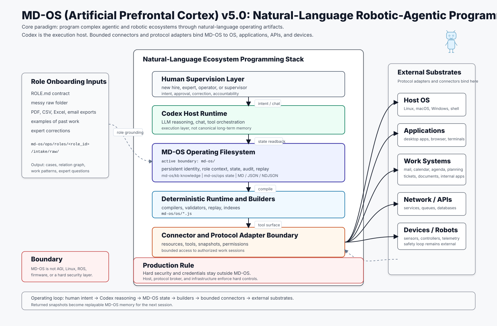

# Popular Introduction to MD-OS (Artificial Prefrontal Cortex) v5.0

MD-OS (Artificial Prefrontal Cortex) v5.0 starts from a simple idea: make the behavior of an
intelligent agent programmable, readable, and supervisable through ordinary
files.

The easiest way to understand the jump is to start from MS-DOS.

In older DOS systems, a batch file contained a sequence of deterministic
commands:

```bat
copy file.txt backup.txt
dir
echo Done
```

The batch file was small, readable, editable, and operational. It was not only
documentation. It was a list of instructions the computer could execute.

MD-OS takes that idea into the world of AI agents, robots, enterprise systems,
and internal tools.

## From Answers To Work

Today, large language models can answer extremely well. But they do not have a
real operating system for work.

MD-OS starts from that problem.

```text
An LLM understands language.
MD-OS organizes work around it.
```

A normal LLM completes missing words in a sentence. It reads linguistic context
and predicts what should come next.

MD-OS extends that idea from text to operations. It reads project state,
available tools, policies, memory, snapshots, and unfinished work. Then it can
detect what is missing, propose the next useful task, route the task through the
right connector, and record the result in a way that can be checked later.

In practical terms, MD-OS does not only ask the AI to respond. It gives the AI a
structure for working.

The simple formula is:

```text
LLM = completes words
MD-OS = completes tasks
LLM + MD-OS = AI with operational continuity
```

The core shift is:

```text
from text completion
to task completion
```

Or, in one sentence:

```text
MD-OS turns an LLM from a model that answers into a system that can follow,
organize, and complete supervised tasks over time.
```

This does not mean MD-OS creates a new model from scratch. It means the static
model is placed inside a persistent operating structure: memory, tasks,
connectors, rules, snapshots, semantic actions, and audit.

## The New Diagram In Plain English



The diagram should be read from the center outward.

At the center is the static LLM. This is the base model: the part that
understands language, reasons, explains, and helps decide what to do.

Around it is the MD-OS semantic runtime. This is the operating layer. It keeps
track of memory, tasks, connectors, policies, snapshots, and semantic actions.

On the right are API, MCP, and connectivity. These are the channels through
which the system can talk to external tools, files, services, devices, and host
runtimes.

At the bottom is the result: a Dynamic Virtual LLM. This is not a second neural
network trained inside the model. It is the behavior produced when a static LLM
is surrounded by persistent operational context.

The easiest metaphor is:

```text
The LLM is the reasoning core.
MD-OS is the external operating structure around it.
```

Or, more vividly:

```text
MD-OS gives a static LLM an external semantic nervous system.
```

That nervous system is made of readable files, connector contracts, task state,
policies, snapshots, audit trails, and deterministic rebuilds. Because those
parts live in the filesystem, people can inspect them, correct them, rebuild
them, and move them across sessions.

In more precise terms:

```text
MD-OS virtualizes semantic-operational nodes on disk.
```

Those nodes are neural-like only by analogy. They are not biological neurons,
model weights, hidden activations, or a second neural network. They are readable
operating objects: notes, tasks, policies, connector profiles, state files,
snapshots, artifacts, schedules, and rebuild outputs. The links between them
create a filesystem-backed semantic neural overlay around the model.

## A Short Public Explanation

MD-OS is a project that gives LLMs operational memory and a structure for
action.

A normal LLM receives a question and produces an answer. MD-OS organizes tasks,
tools, rules, and memory around the model, so a request can become a controlled
action connected to the state of a project.

The main idea is simple: if LLMs complete sentences, MD-OS tries to complete
tasks. It looks at what is missing in a process and prepares the next useful
step.

## A Very Short Version

MD-OS is like an operating layer for helping an AI work.

The AI understands language. MD-OS organizes the work.

Together, the model does not only answer. It can follow tasks, remember state,
use bounded connectors, and propose the next step.

## LinkedIn-Style Version

LLMs today complete text.

The question is: can they also complete tasks?

MD-OS starts from that idea. It builds an operating layer around a static LLM:
memory, connectors, rules, snapshots, and semantic actions.

The model remains at the center, but it no longer works only inside a chat. It
is connected to an operating space where each request can become a task, each
task can produce state, and each state can suggest the next useful step.

In short:

```text
from text completion
to task completion
```

## How To Say It Safely

Avoid opening with claims such as:

```text
I created a new AI.
It can do everything.
It is fully autonomous.
It is a universal system.
```

Better:

```text
MD-OS is a semantic operating layer for LLMs.
```

Also acceptable, when the boundary is stated clearly:

```text
MD-OS is a semantic operating system for agents.
```

Here "operating system" does not mean a kernel, Linux replacement, robotics
middleware, or autonomous intelligence. It means an Operating Filesystem: a
readable control plane where semantic instructions, state, policies,
connectors, artifacts, and rebuilds organize supervised work.

Or, more publicly:

```text
MD-OS is a structure that helps an AI turn requests into organized,
supervised work.
```

## From Batch Files to Markdown Files

In MD-OS, the operational file is no longer only a rigid batch of commands. It
becomes a Markdown artifact:

```md
# Procedure: urgent ticket triage

## Objective

Understand whether the ticket blocks production.

## Conditions

- if the customer is blocked
- if a critical code is missing
- if approval is required

## Actions

- classify the ticket
- search for similar cases
- propose the next step
- ask for confirmation if authorization is required
```

This Markdown is not a volatile prompt. It is a small natural-language
operating program: readable by a person, interpretable by Codex, and
materialized by deterministic builders under `md-os/os/`.

The difference from a classic batch file is that Markdown can carry meaning,
context, rules, exceptions, links, and operating intent.

## The Semantic Network

MD-OS Markdown files can link to each other:

- a procedure links to a policy;
- a policy links to a permission model;
- a role links to operational cases;
- a ticket links to a recurring cause;
- a connector links to the enterprise system it can read;
- an action links to its required approval.

This creates a logical, semantic, and operational network.

With Obsidian, one of the strongest visual surfaces for Markdown files, MD-OS
can be read as a map of connected concepts. The system is not a closed box. It
is a visible network of operational knowledge.

## Operational Intelligence As A Semantic Space

MD-OS can also be understood as a semantic action field around a reasoning
model.

A normal batch file lists deterministic commands in one direction. MD-OS keeps
the readability of that idea, but adds semantic dimensions:

- intent
- memory
- project state
- active tasks
- permissions
- policies
- connector capabilities
- artifacts
- expected state transitions
- audit and replay

Each dimension narrows or opens the possible next actions. Together, they form
an inspectable operating space. A request is not only answered; it is placed
inside a field of possible supervised actions.

In compact form:

```text
semantic dimensions + bounded procedures + persistent state
  -> semantic action field
  -> supervised task completion
```

This is where operational intelligence appears in MD-OS. It does not come from
hidden autonomy or a magical new model. It comes from the coordination of many
small readable semantic units: programs, work items, connector contracts,
policies, snapshots, journals, builders, and artifacts.

The result is emergent in the practical sense: each unit can be simple, but the
filesystem can combine them into a larger space of useful next actions. Because
that space is written down, humans and agents can inspect it, correct it, and
rebuild it.

This is the important difference from a hidden neural network. The semantic
nodes live on disk as ordinary files. They can be opened, edited, linked,
rebuilt, audited, and replayed.

## From Clues To Claims

MD-OS is useful not only for tasks, but also for ideas.

In ordinary work, a theory, a diagnosis, or a project decision often starts as
a clue: a note, a pattern, a weak signal, a partial calculation, or a recurring
problem. The risk is that these pieces remain scattered, or that an early
intuition is later presented as if it were already proven.

MD-OS gives this process a practical lifecycle:

```text
clue or intuition
  -> note or intake material
  -> line of thought
  -> frozen principle
  -> derivation
  -> prediction or readback
  -> correction
  -> replay
```

In concrete filesystem terms:

- heuristic material becomes notes, journal entries, intake files, and raw
  analysis;
- a line of thought becomes linked notes, work items, natural-language
  programs, and dependency sketches;
- a frozen principle becomes source of truth, such as `md-os/kb/**`, `ME.md`,
  `AGENTS.md`, or a canonical program;
- a derivation becomes a deterministic script, a builder, or another
  reproducible transform;
- prediction or readback becomes a declared gate, connector snapshot, audit
  result, or comparison artifact;
- correction becomes a change proposal, source edit, rebuild, and replay.

The important guardrail is simple:

```text
A result can be reproducible and still not be a prediction.
```

A strict prediction requires the target, time or version, input state,
assumptions, and comparison method to be declared before readback. If the
result is checked against data already known to the system, MD-OS should call
it retrodiction. If it depends on unfinished assumptions, it should call it
conditional. If it is only a useful direction, it should remain heuristic.

This is the practical meaning of saying that MD-OS can linearize thought in
geometric-procedural form. Ideas become nodes. Dependencies become edges.
Procedures become paths. Checks become gates. The filesystem does not make a
theory true by storing it, but it preserves the chain well enough for humans
and tools to inspect where a claim came from, what could falsify it, and what
changed after correction.

## Why MD-OS APFC

APFC means **Artificial Prefrontal Cortex**. It names the bounded executive
control plane of MD-OS, not a biological claim. The metaphor
is functional: it allocates attention and working context, schedules and
interrupts work, gates permissions, coordinates input/output, and compares
expected results with verified readback.

MD-OS APFC receives small semantic instructions, similar in spirit to UNIX
processes and old batch files, but richer:

- objectives;
- roles;
- conditions;
- limits;
- exceptions;
- procedures;
- expert questions;
- allowed actions;
- actions that require approval.

Each file is a small operating unit. Alone, it does little. Inside an ordered
structure, with a host model as the execution layer and `md-os/` as the
operational boundary, many small verified agentic processes become a system.

## Codex Orchestration

Codex is not the persistent identity of the system. Codex is the host runtime:
it reads files, reasons, converses, uses tools, and coordinates operations.

MD-OS is the persistent operating memory:

```text
Codex = reasoning and orchestration runtime
MD-OS = persistent operating filesystem
MCP = tool and resource surface
md-os/os = deterministic builders
md-os/ops = runtime state
md-os/kb = stable knowledge
```

This separation matters. The agent does not live only in chat. It also lives in
the files that declare what it knows, what it must do, what it cannot do, what
it has done, and what it intends to do next.

## The New-Hire Desk Problem

A concrete workplace example makes the purpose clearer.

In many companies, a new employee does not receive a clean operating manual.
They receive a desk, an account, a few vague explanations, and then a truck of
messy work backs up to the desk:

- old PDFs;
- spreadsheets;
- exported ticket lists;
- email threads;
- calendar obligations;
- half-written procedures;
- screenshots;
- internal notes;
- exceptions known only by senior people;
- repetitive tasks that nobody has properly formalized.

The new hire is expected to understand the role, connect the material, discover
what matters, avoid internal mistakes, ask the right expert questions, and
start producing useful work quickly.

MD-OS treats that pile as an operating input, not as a training inconvenience.
The company can place the raw material for one role into:

```text
md-os/ops/roles/<role_id>/intake/raw/
```

MD-OS APFC then helps turn the pile into an operating map:

```text
raw files
  -> inventory
  -> entities
  -> cases
  -> recurring work patterns
  -> candidate operations
  -> expert questions
  -> role-bounded next actions
```

Through Codex chat, the employee can ask MD-OS APFC what to do, why it matters, what
evidence supports the answer, what is missing, and which action is safe to take
next.

Where MCP resources are available, MD-OS APFC can also work on the employee's real
surface: mail, calendar, agenda, planning systems, documents, tickets, internal
applications, files, and dashboards. These are the tools already authenticated
for the employee and supervised by the employee. MD-OS does not require a new
custom API project before the role can become useful.

The practical target is not only learning. It is assisted execution.

MD-OS APFC can automatically structure the pile, prepare task lists, draft replies,
classify tickets, correlate similar cases, propose next actions, update
rebuildable state, and execute bounded connector actions when the action is
explicit, authorized, and auditable. When the evidence is weak or the role
boundary is unclear, MD-OS APFC stops and produces questions for a human expert
instead of inventing policy.

This is the workplace value of MD-OS: reduce onboarding time, reduce repeated
internal errors, preserve operational knowledge, and help a new employee move
from chaotic material to supervised useful action.

## Transparency Instead of a Black Box

A raw LLM is often a black box:

- its goals are not always explicit;
- its memory across sessions is uncertain;
- its operating rules may not be written anywhere inspectable;
- its intended next actions may be unclear;
- its memory is not naturally reviewable or correctable.

MD-OS changes the paradigm.

Goals, rules, limits, tasks, cases, connectors, questions, and operating
intentions are placed in readable files. A person can open those files, correct
them, discuss them, version them, rebuild them, and verify them.

This makes the operating process transparent:

```text
what the agent knows -> knowledge files
what it must do -> agenda and work items
what it may do -> policy and connector registry
what it did -> journal and snapshots
what is unclear -> expert questions
what it wants to do next -> next steps and operating programs
```

## The Biological Metaphor

MD-OS can also be understood through a biological metaphor.

A living organism does not work because one single cell does everything. It
works because many small, specialized, coordinated units produce complex
behavior.

In MD-OS:

- Markdown files are small operating cells;
- deterministic builders are metabolic processes;
- connectors are senses and limbs;
- the journal is historical memory;
- policies are the immune system;
- Codex is the momentary operating nervous system;
- `md-os/` is the filesystem body that preserves everything.

The result does not come from one giant file. It comes from the orchestration
of many small readable units.

This is the difference from simple prompting. The model is not asked to
remember everything. Instead, an operating environment is built where many
small semantic instructions can cooperate.

## The Core Point

MD-OS is a semantic operating system for agents.

It is not a kernel. It is not Linux. It is not ROS. It is not AGI.

It is an Operating Filesystem: a way to program a complex agentic and robotic
ecosystem in natural language while keeping everything readable,
reconstructible, auditable, and correctable.

The short formula is:

```text
MS-DOS batch file
  -> readable deterministic commands

MD-OS Markdown file
  -> readable semantic instructions
  -> linked into a logical network
  -> orchestrated by Codex
  -> materialized by deterministic builders
  -> exposed to real tools through MCP
  -> made transparent to humans
```

This is MD-OS (Artificial Prefrontal Cortex) v5.0: a shift from deterministic textual commands to
semantic operating programs inside a filesystem designed for agents, robots,
enterprise tools, and real continuity.
